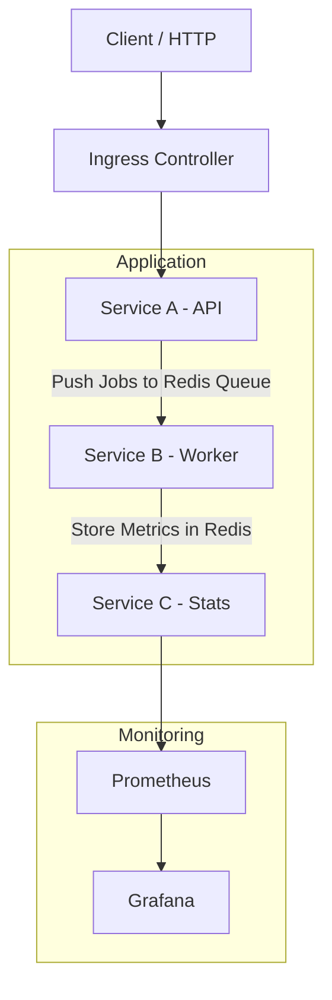

# Kubernetes Microservices Monitoring

A queue-based Node.js microservices system deployed on Kubernetes with autoscaling, Prometheus metrics, and Grafana dashboards.

---

## Architecture



**Job types**: `prime numbers count` | `hash - bcrypt 10 rounds` | `sort upto n numbers`

---

## Prerequisites

| Tool     | Windows                                                                   | Linux/Ubuntu |
| -------- | ------------------------------------------------------------------------- | ------------ |
| Minikube | [minikube.sigs.k8s.io](https://minikube.sigs.k8s.io/docs/start/)          | same         |
| kubectl  | [kubernetes.io/docs/tasks/tools](https://kubernetes.io/docs/tasks/tools/) | same         |
| pnpm     | [pnpm.io/installation](https://pnpm.io/installation)                      | same         |

---

## Deploy

### 1. Start Minikube

**Windows (PowerShell as Admin)**

```powershell
# If port 80 is in use (e.g. Apache), stop it first
Stop-Service -Name Apache* -Force

minikube start
minikube addons enable ingress
minikube addons enable metrics-server
```

**Linux/Ubuntu**

```bash
minikube start
minikube addons enable ingress
minikube addons enable metrics-server
```

Wait for the ingress controller:

**Windows**

```powershell
kubectl wait --namespace ingress-nginx `
  --for=condition=ready pod `
  --selector=app.kubernetes.io/component=controller `
  --timeout=120s
```

**Linux**

```bash
kubectl wait --namespace ingress-nginx \
  --for=condition=ready pod \
  --selector=app.kubernetes.io/component=controller \
  --timeout=120s
```

---

### 2. Build images into Minikube

Run from the **repo root**:

**Windows / Ubuntu**

```cmd
minikube image build -f apps/api/Dockerfile    -t monitoring-api    .
minikube image build -f apps/worker/Dockerfile -t monitoring-worker .
minikube image build -f apps/stats/Dockerfile  -t monitoring-stats  .
```

`Images are built directly inside Minikube's Docker daemon — no registry needed.`

---

### 3. Deploy the full stack

```bash
kubectl apply -k k8s/
```

Wait for all pods to be Running

```bash
kubectl get pods -n monitoring-app --watch
```

---

### 4. Expose via Minikube tunnel

**Windows (new Admin PowerShell — keep open)**

```powershell
minikube tunnel
```

**Linux (new terminal — keep open)**

```bash
sudo minikube tunnel
```

---

### 5. Add hosts file entries (one-time)

**Windows (Admin PowerShell)**

```powershell
Add-Content -Path "C:\Windows\System32\drivers\etc\hosts" `
  -Value "127.0.0.1 api.local grafana.local prometheus.local"
```

**Linux**

```bash
echo "127.0.0.1 api.local grafana.local prometheus.local" | sudo tee -a /etc/hosts
```

---

### 6. Verify

```bash
kubectl get pods    -n monitoring-app
kubectl get ingress -n monitoring-app

curl http://api.local/health
# Expected: {"status":"ok"}
```

---

## Access Points

| URL                           | Description                        |
| ----------------------------- | ---------------------------------- |
| `http://api.local/submit`     | Submit a job (`POST`)              |
| `http://api.local/status/:id` | Check job status                   |
| `http://api.local/jobs`       | List all jobs                      |
| `http://api.local/stats`      | Aggregated stats                   |
| `http://grafana.local`        | Grafana dashboards (admin / admin) |
| `http://prometheus.local`     | Prometheus query UI                |

---

## Stress Testing

**Windows** — use the binaries in `ab-testing/`:

```powershell
cd ab-testing

# Baseline
.\ab.exe -n 1000 -c 50 http://api.local/health

# CPU-intensive jobs (triggers autoscaling)
.\ab.exe -n 500 -c 25 -p payload.json -T "application/json" http://api.local/submit
```

**Linux** — install `apache2-utils` then use `ab`:

```bash
sudo apt install apache2-utils   # Ubuntu/Debian

# Baseline
ab -n 1000 -c 50 http://api.local/health

# CPU-intensive jobs (triggers autoscaling)
ab -n 500 -c 25 -p ab-testing/payload.json -T "application/json" http://api.local/submit
```

Watch autoscaling in a separate terminal:

**Windows**

```powershell
while($true) { Clear-Host; kubectl get hpa,pods -n monitoring-app; Start-Sleep 5 }
# In every 5 seconds it will refresh the terminal
```

**Linux**

```bash
watch -n 5 kubectl get hpa,pods -n monitoring-app
```

---

## Updating App Code

After editing source files:

```bash
minikube image build -f apps/api/Dockerfile    -t monitoring-api    .
minikube image build -f apps/worker/Dockerfile -t monitoring-worker .
minikube image build -f apps/stats/Dockerfile  -t monitoring-stats  .

kubectl rollout restart deployment/monitoring-app    -n monitoring-app
kubectl rollout restart deployment/monitoring-worker -n monitoring-app
kubectl rollout restart deployment/monitoring-stats  -n monitoring-app
```

---

## Remove All resources

```bash
kubectl delete -k k8s/   # remove all resources
minikube delete           # wipe the cluster
```

---

## Troubleshooting

| Symptom                             | Fix                                       |
| ----------------------------------- | ----------------------------------------- |
| `ImagePullBackOff`                  | Rebuild images into Minikube (Step 2)     |
| `CrashLoopBackOff`                  | `kubectl logs <pod> -n monitoring-app`    |
| `Could not resolve host: api.local` | Add hosts file entry (Step 5)             |
| `curl` times out                    | `minikube tunnel` not running (Step 4)    |
| HPA shows `<unknown>` CPU           | Enable metrics-server, wait ~60 s         |
| Port 80 conflict (Windows)          | Stop the service holding port 80 (Step 1) |
